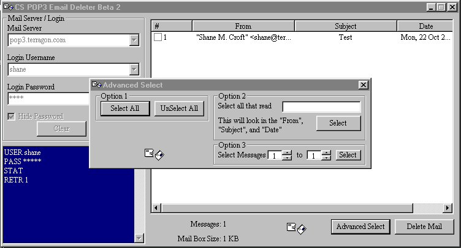



## CS POP3 Email Deleter Beta 2

### Description

This application allows you to login into a POP3 server, list all e-mails on that server and delete the e-mails of your choice off the server. This is a great tool for a number of purposes, such as screening for spam. The application as written does not display the message body, but because messages are encapsulated into a CMessage class which includes a MessageBody property, it would be easy to add this functionality.
 
### More Info
 

             |
---                |---
**Submitted On**   |2001-10-22 09:19:16
**By**             |[Shane Croft](https://github.com/Planet-Source-Code/PSCIndex/blob/master/ByAuthor/shane-croft.md)
**Level**          |Intermediate
**User Rating**    |4.8 (58 globes from 12 users)
**Compatibility**  |VB 6\.0
**Category**       |[Complete Applications](https://github.com/Planet-Source-Code/PSCIndex/blob/master/ByCategory/complete-applications__1-27.md)
**World**          |[Visual Basic](https://github.com/Planet-Source-Code/PSCIndex/blob/master/ByWorld/visual-basic.md)
**Archive File**   |[CS POP3 Em3042410222001\.zip](https://github.com/Planet-Source-Code/shane-croft-cs-pop3-email-deleter-beta-2__1-28332/archive/master.zip)

